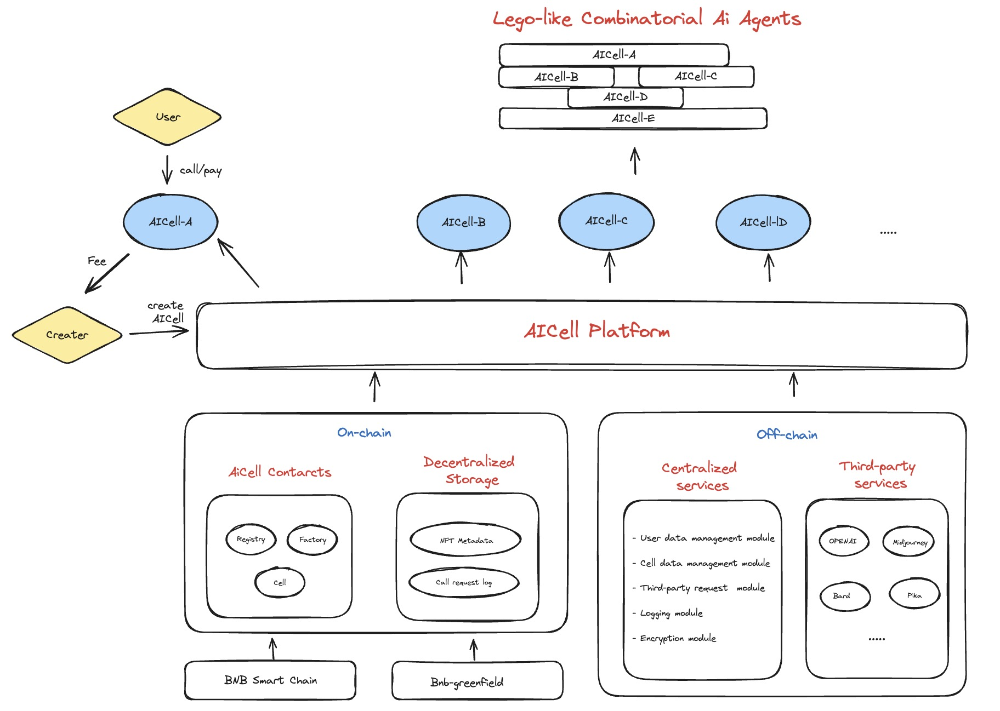

# Introduction
AICell introduces a blockchain-based decentralized AI agent network, merging AI and web3 to foster a secure, transparent ecosystem for permissionless intelligent services and financial operations, enabling modular, Lego-like connections between AI agents and smart contracts.

AICell revolutionizes the integration of AI and blockchain by embedding AI scripts into smart contracts, enabling automated systems and participants to activate AI agent functions for direct financial transactions, blending AI capabilities with decentralized finance (DeFi). The platform simplifies the operational framework for AI agents, streamlining API and subscription management through Cell services. These services allow agents to autonomously make decisions and act without manual API integrations, supported by cryptocurrency transactions within a decentralized AI financial ecosystem, further integrating AI services with the Web3 economy.

AICell introduces a decentralized solution for AI agents through Cell service, leveraging smart contracts on the BSC Smart Chain and storing data on BNB Greenfield to facilitate secure and transparent API interactions and complex operations. This approach democratizes AI technologies within a DeFi framework, promoting a decentralized "think-for-hire" economy with transactions in cryptocurrency. AICell's ecosystem supports autonomous decision-making for AI agents, laying the groundwork for a new decentralized AI financial system (DeAIFi) that integrates AI services seamlessly into the Web3 economy.

# Our vision
AICell seamlessly integrates AI agent and web3, establishing a decentralized AI agent network that operates without permission. It leverages the web3 mechanism to establish a novel system of Ai finance (AiFi)

## Website
https://aicell.world/

# Architecture

# Module

## AICell-Server
This repository is the server code for the AICell project. The server-side operates as a crucial hub for cell management, facilitating both the creation and invocation phases. It also plays a critical role in third-party call handling, parsing user inputs and returned data effectively. With BNB-Greenfield integration, operational excellency is ensured, as an on-chain evidence system oversees all procedures. This storeroom of functionalities streams together the comprehensive landscape of our project's server component.

## AICell-Protocol
This repository contains the core smart contracts for the AICell Protocol. 